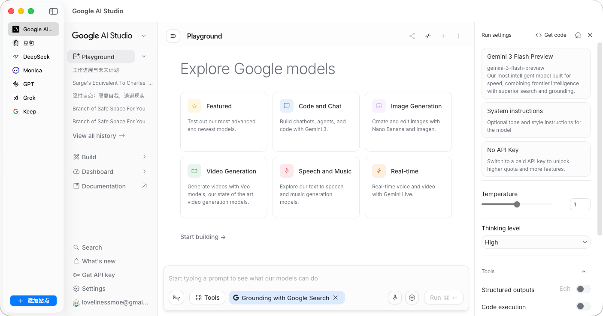

# AIPortals

一款原生 macOS 应用，将所有常用 AI 工具整合到一个窗口。通过侧边栏一键切换 AI 服务，告别反复切换浏览器标签页。



## 功能特性

- **一键切换** — 侧边栏直接切换 AI 工具
- **保持登录** — 切换标签页不会丢失会话和登录状态
- **自动图标** — 自动加载各网站 favicon
- **自定义站点** — 可添加任意 AI 网页应用
- **深色/浅色模式** — 跟随系统外观自动切换

## 内置站点

- Google AI Studio
- 豆包
- DeepSeek
- Monica
- ChatGPT
- Grok

## 安装

1. 从 [Releases](../../releases) 下载最新 `.zip`
2. 解压后将 `AIPortals.app` 拖入「应用程序」文件夹
3. 首次启动右键点击 → **打开**（未签名应用需要此步骤）

## 系统要求

- macOS 13 Ventura 及以上

## 从源码构建

```bash
git clone https://github.com/lovelinessmoe/AIPortals.git
cd AIPortals
open mmaipad.xcodeproj
```

在 Xcode 中按 `⌘R` 运行。
